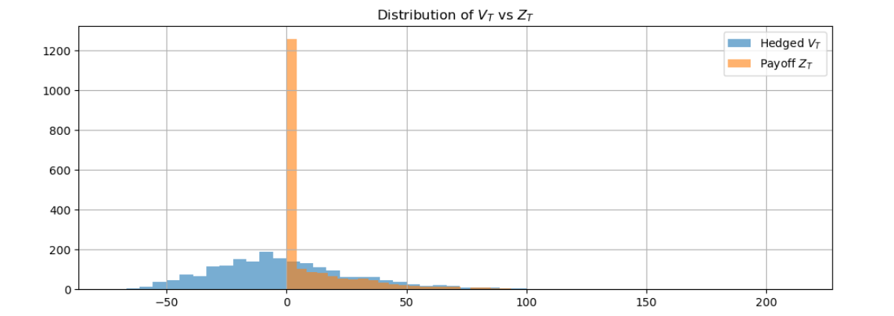
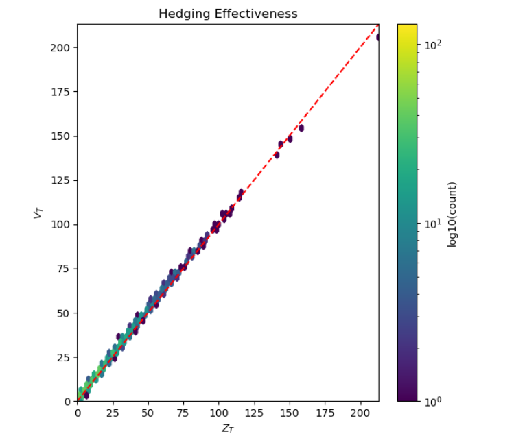
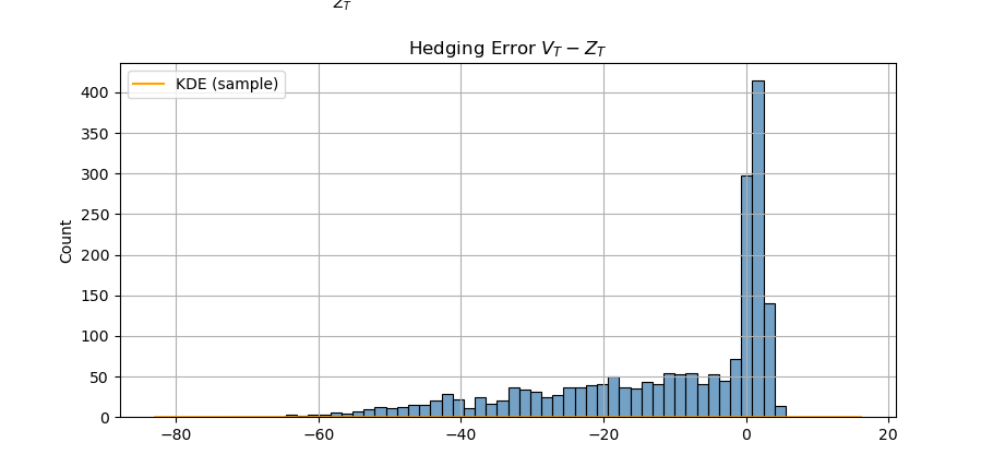

# Deep Hedging Neural Network for Derivatives Pricing

**A machine learning project implementing Deep Hedging using PyTorch to learn dynamic risk management strategies for European options under realistic market conditions.**

---

## Project Overview

This project replicates the ideas in Bühler et al.'s *Deep Hedging* framework to train a neural network to hedge a European call option. It includes:

-  Realistic market simulation with volatility spikes, jumps, and regime switching
-  GRU-based neural network model
-  Custom CVaR-based risk objective function
-  Backtesting & benchmarking with rich visualizations

---

##  Repository Structure

```
Deep-Hedging-Neural-Network-for-Derivatives-Pricing/
├── 1_Theory_and_Background.ipynb
├── 2_Data_Simulation.ipynb
├── 3_Deep_Hedging_Model.ipynb
├── 4_Backtesting_and_Validation.ipynb
├── training_log.txt
├── requirements.txt
├── data/
│ └── deep_hedging_data.npz
├── results/
│ └── hedging_eval_test.npz
├── models/
│ └── gru_beta010_final.pt
├── visualizations/
│ ├── vt_vs_zt_histogram.png
│ ├── vt_vs_zt_scatter.png
│ └── hedging_error_distribution.png
├── README.md
├── LICENSE
```

## Notebooks Summary

### 1_Theory_and_Background.ipynb

- Intro to options, hedging, stochastic processes
- Intuition behind deep hedging
- Literature summary (Bühler et al.)

### 2_Data_Simulation.ipynb

- Simulates realistic asset price paths using:
  - Geometric Brownian Motion
  - Regime switching
  - Price jumps
  - Volatility spikes
- Computes European call payoffs
- Constructs features (normalized price, log returns, volatility, time to maturity)

### 3_Deep_Hedging_Model.ipynb

- GRU-based neural network predicting hedge ratios dynamically
- Custom objective:
  - CVaR + MSE on ITM options
- Includes transaction cost simulation
- Saves model + evaluation results

### 4_Backtesting_and_Validation.ipynb

- Compares predicted terminal portfolio value $( V_T )$ with true payoff $( Z_T )$
- Visualizations:
  - Distribution of $( V_T )$ vs $( Z_T )$
  - Hedging effectiveness (scatter)
  - Hedging error histogram
- Computes MAE and relative error (ITM-only)

---

## Key Visualizations

### Distribution of $( V_T )$ vs $( Z_T )$


### Hedging Effectiveness — Scatter


### Hedging Error $( V_T - Z_T $)$


---

## Requirements

Install the following Python packages:

- `numpy`
- `matplotlib`
- `seaborn`
- `scikit-learn`
- `torch` (PyTorch)
- `IPython` (for display utilities in Jupyter)
- `JupyterLab` or `Jupyter Notebook`

You can install all dependencies with:

```bash
pip install -r requirements.txt
```

## Final Results

| Metric                    | Value      |
| ------------------------- | ---------- |
| MAE (ITM only)            | **1.538**  |
| Mean Relative Error (ITM) | **19.17%** |

Model closely replicates the payoff for in-the-money options and shows high correlation in final hedge value vs true value.

## Citation

Based on:

    Bühler, Hans, et al. Deep Hedging. Quantitative Finance (2019)


## Author

**Georgios Drosogiannis**  
 MSc in Applied Mathematics (NTUA)    
[LinkedIn](https://www.linkedin.com/in/georgios-drosogiannis/)  
[GitHub](https://github.com/George-Dros)

---

## License

This project is licensed under the MIT License. See the [LICENSE](LICENSE) file for details.
