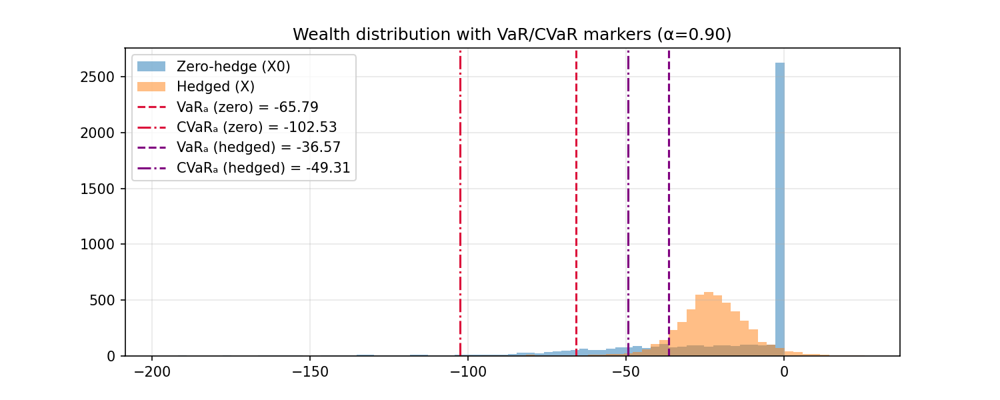
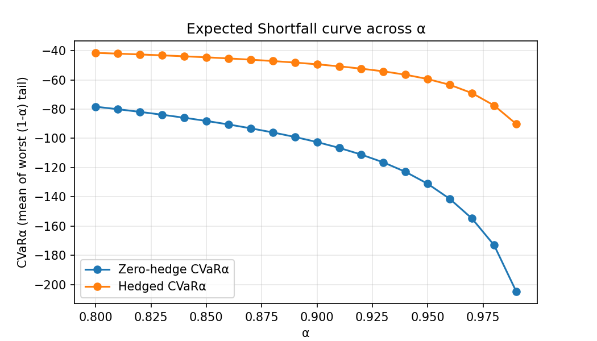
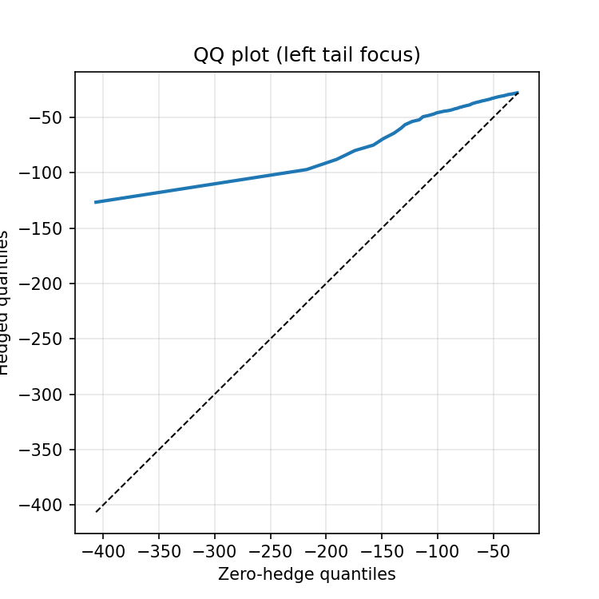

# Deep Hedging Neural Network for Derivatives Pricing

> A from-scratch implementation of deep hedging that directly optimizes CVaR of the terminal hedging error under realistic trading frictions. Built as a 4-notebook, end-to-end project you can run and extend.


---

## Repo tour

- **1_Theory_and_Background** — problem setup, notation, CVaR/OCE risk, objective.
- **2_Data_Simulation** — Monte Carlo paths under **GBM or Heston** (toggle), plus feature engineering used by the policy.
- **3_Deep_Hedging_Model-Keras** — policy network, RU/OCE head for CVaR, training loop with callbacks, metrics & logging.
- **4_Backtesting_and_Validation** — out-of-sample evaluation and plots: tail histograms with VaR/CVaR markers, ES curves across $α$, left-tail QQ, ECDF, and effectiveness metrics.

---

## Headline results (test set)

Numbers latest run with $α=0.90$ (CVaR$_{90}$), proportional costs, and early stopping:

- **CVaR$_{90}$**: **−11.52** (hedged) vs **−32.16** (zero-hedge)  
- **VaR$_{90}$**: **−10.30** (hedged) vs **−23.92** (zero-hedge)  
- **Variance reduction** of $X$: **≈ 96%**  
- **MAE reduction** of $X$: **≈ 1–2%** (small by design: we optimize tails, not MAE)  
- **Mean trading cost** per path: **≈ 0.15**  
- **Average turnover** (sum over time, per path): **≈ 3.0**

> Interpretation: the network **dominates the left tail** (much less negative losses), which is the stated objective. MAE barely changes—this is expected when optimizing CVaR rather than $L^1$.

---

## Screenshots


1) **Wealth distribution with VaR/CVaR markers (α=0.90)**  
Shows histograms of $X$ for zero-hedge vs hedged with vertical lines for VaR and CVaR.  
- What to look for: **hedged** histogram remains **left** of the big zero-spike but has a **much lighter extreme left tail**; hedged VaR/CVaR lines sit **to the right** (less negative).  


2) **Expected Shortfall curve across α** (CVaR$_α$ vs $α$)  
- What to look for: the **hedged curve sits above (less negative)** the zero-hedge for all $α∈[0.80,0.99]$, meaning **smaller expected shortfall** everywhere in the tail.  


3) **Left-tail QQ plot** (hedged quantiles vs zero-hedge, 0–30% tail)  
- What to look for: the curve lies **below the 45° line** in the far left region → **hedged left tail is thinner** than baseline.  


4) **Empirical CDF (zoomed to left/center)**  
- What to look for: **hedged ECDF dominates** (is to the right) near loss regions → better outcomes for adverse quantiles.  


5) **Stakeholder view (premium-shifted)**  
Overlay $V_T^{true} := P_0 + V_T$ against $Z_T$. This reframes wealth with a premium proxy $P_0≈E[Z_T]$ so stakeholders can compare “price-paid vs payoff”.  


---

## Method in one diagram

1. **Simulate market** under GBM or **Heston** (stochastic vol).  
2. **Features**: price/scaled returns, realized vol proxy, moneyness, time-to-maturity (example set of four).  
3. **Policy network** outputs trades over time; **proportional costs** apply.  
4. Compute terminal **hedging error** $X=V_T-Z_T$.  
5. **RU/OCE head** with parameter $τ$ implements CVaR utility:  
   - Loss per path: $\ell(X)=\frac{(τ-X)^+}{1-α}-τ$.  
   - Train $τ$ jointly with the policy.  
6. **Callbacks**: ReduceLROnPlateau, EarlyStopping, ModelCheckpoint (best CVaR).  
7. **Out-of-sample eval**: VaR/CVaR, ES curves, tail QQ/ECDF, cost & turnover.

---

## How to run

```bash
# 1) Create env
python -m venv .venv
source .venv/bin/activate  # (Windows: .venv\Scripts\activate)

# 2) Install
pip install -r requirements.txt
# core: numpy, pandas, matplotlib, seaborn, tensorflow>=2.12, tqdm

# 3) Execute notebooks in order
# 1_Theory_and_Background.ipynb (read-only)
# 2_Data_Simulation.ipynb       (choose GBM/Heston, path counts, seeds)
# 3_Deep_Hedging_Model-Keras.ipynb (train; saves weights + npz eval)
# 4_Backtesting_and_Validation.ipynb (plots + metrics)
```

**Artifacts**  
- Trained weights: `results/best_tail_by_cvar.weights.h5`  
- Test evaluation arrays: `results/hedging_eval_test_keras_4.npz` with `V_T, Z_T`  

---

## Configuration used for the “final” run

- **Risk level**: $α = 0.90$ (CVaR$_{90}$)  
- **Objective**: RU/OCE CVaR of $X$ (+ tiny MAE regularizer with $β=0.01$)  
- **Optimizer**: Adam (lr ≈ 1e-3 with ReduceLROnPlateau → min 1e-5)  
- **Epochs**: up to 150 with early stopping (best around ~100–150)  
- **Batch**: 400  
- **Costs**: proportional; **turnover** tracked as a metric  
- **Baseline**: zero-hedge $X_0=-Z_T$

> Note on MAE: pushing MAE down meaningfully conflicts with tail optimization. Experimented with large $β$ and saw CVaR get worse. For a CVaR-first portfolio, keeping $β$ tiny is the right call.

---

## What “good” looks like here

- **Thinner left tail**: hedged CVaR and VaR **less negative** than baseline.  
- **ES curve dominance**: hedged CVaR$_α$ **above** baseline across $α$ grid.  
- **Stable $τ$** (RU head) and smooth validation CVaR.  
- **Reasonable costs/turnover**: tail gains shouldn’t come from infinite churning.

---

## Extending this project

- **Multiple payoffs**: calls + puts, and **strike conditioning** (one-hot or numeric $K$ as an input).  
- **Portfolio of options**: vectorized $Z_T$ and multi-asset underlying.  
- **Richer features**: implied/realized vol, term-structure snippets, skew.  
- **Risk target sweeps**: train separate policies for $α∈\{0.85,0.90,0.95\}$ and plot the Pareto frontier between CVaR and MAE/variance.  
- **Alternate markets**: rough volatility, jumps, or historical resampling.

---

## References (for readers)

- Deep Hedging (Buehler et al., 2019), and the **OCE** formulation used for CVaR-style objectives.  
- JPM/industry decks that showcase **ES curves**, **tail QQ**, and **VaR/CVaR overlays** as the right diagnostics for tail-risk control.

---

## License

MIT

